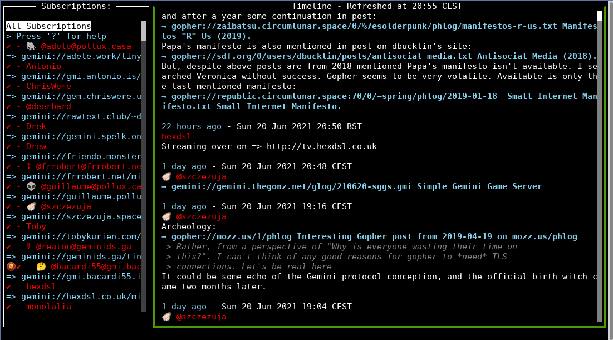

Official repository and project is on [codeberg](https://codeberg.org/bacardi55/gtl). Github is only a mirror.

# GTL: Gemini Tiny Logs

Goal: A TUI for the [tinylogs](https://codeberg.org/bacardi55/gemini-tinylog-rfc/src/branch/main) format on the [gemini](gemini.circumlunar.space/) space.



## Quick start:

*Assuming you downloaded the right binary for your system and put it in your binary, eg: ~/bin*:
```
# will create the configuration and subscription files in ~/.config/gtl/ and subscribe to tinylog aggregator (gemini://tinylogs.gmi.bacardi55.io).
~/bin/gtl
```

To read the global help:
```
gtl --help
```

## Installation

Please read the [installation page](docs/install.md).

## Configuration

Please read the [configuration page](docs/config.md)

## Usage

Gtl can run in 3 modes:
* TUI: An interactive TUI. See the [TUI mode documentation](docs/mode-tui.md).
* CLI: A command line interface. See the [CLI mode documentation](docs/mode-cli.md).
* Gemini: A mode that return a text/gemini output, compatible with the Tinylog format. See the [Gemini mode documentation](docs/mode-gemini.md).

