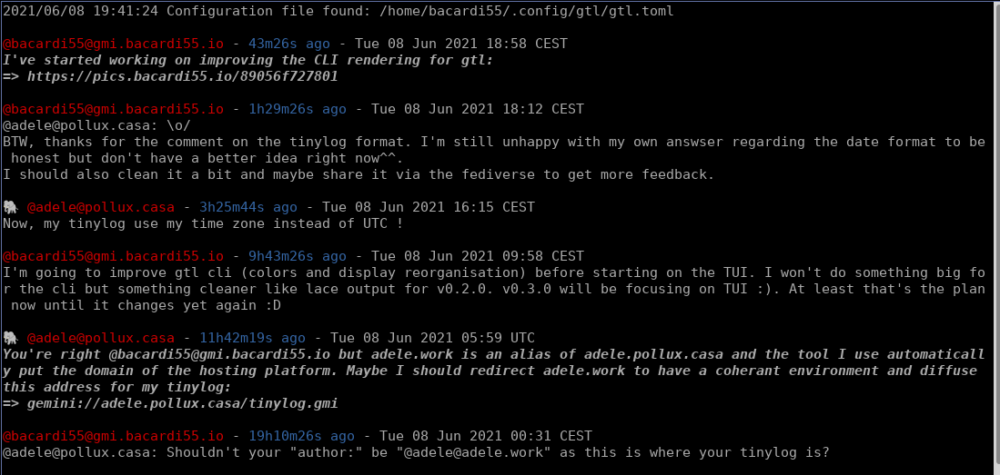

# GTL: Go Tiny Logs

Goal: A TUI for the [tinylogs](https://codeberg.org/bacardi55/gemini-tinylog-rfc/src/branch/main) format on the [gemini](gemini.circumlunar.space/) space.

Status: Work In Progress, only the CLI mode is available at this stage.

# Installation

gtl requires go ≥ 1.5

# From Source
```
git clone http://git.bacardi55.io/bacardi55/gtl.git
cd gtl
make dependencies
make build
```

Put the binary in a directory available in your $PATH if you don't want to type the full path to the program.

# From Binaries

You can download binaries for linux [here](https://github.com/bacardi55/gtl/releases).
Binaries are only available for linux 386, amd64, arm and arm64 for now.

# Usage

## Quick start:

*Assuming you put the binary in ~/bin*:
```
mkdir ~/.config/gtl/ # Not created automatically, known issue.
~/bin/gtl # will create the configuration and subscription files in ~/.config/gtl/
~/bin/gtl add --url gemini://gmi.bacardi55.io/tinylog.gmi # Adding an entry will create the sub file.
# Repeat add command for all the feeds.
~/bin/gtl --mode cli --limit 10
# Or use the TUI mode:
~/bin/gtl --mode tui
```

You can still use gtl "continuously":
```
while true; do clear && ~/bin/gtl --mode cli --limit 10 && sleep 1800; done;
```

Or use the TUI and refresh the timeline when you want.

## Global commands:
```
gtl --help
gtl --version
```

## Use gtl TUI

```
gtl --mode tui
```
or configure the `gtl.toml` to set `mode = tui` (see config below).

Screenshot of the TUI below.

**TUI Shortcuts:**
```
Ctrl-R: Refresh timeline (refresh all tinylogs)
Ctrl-T: Display timeline
Ctrl-H: Display entries containing highlights (See configuration for highlights)
Tab: Switch between timeline and subscription list.
Ctrl-C or Ctrl-Q: Quit
```
You can navigate on the subscription list and click on a specific tinylog to only display entries from this author.

**TUI Emoji Status:**

* ❌: Indicates that the feed is unreachable.
* ❌🔓: Indicates an error with the SSL certificate.

**Known issue**: Emoji status isn't actualized when feeds are refreshed.

## Use gtl CLI
```
Usage:
	--config configFile	Indicate a specific config file.
	--mode {cli,tui}	Select the cli or tui mode.
	--limit X		When using cli mode, display only X item.
	--help			Display this help message.
```

Example:
```bash
gtl --mode cli --limit 10
gtl --limit 10 # cli mode is default, so this is the same as above.
gtl --mode cli --limit 10 --config path/to/config/file # with specific path for config file.
```

If you don't provide a config file path, gtl will look for it in `{homepath}/.config/gtl/gtl.toml`

You need a subscription file though with the list of tinylogs to follow. For easier migration, the format is the same as [lace](https://friendo.monster/log/lace.html):
```
<urlOfTinyLog> nameOfTinyLog
<urlOfTinyLog2> nameOfTinyLog2
…
```

**Warning**: The `nameOfTinyLog` is optional. But if you don't indicate one and the tinylog doesn't have an `author: @authorName` metadata, gtl will not no what to display for the author and will indicate "unknown"

This file should be in your configuration file:

```toml
subscribed_data = "path/to/sub/file"
```

Screenshot of the CLI below.

# Default config file

```toml
# Default config file:
# Path to subscribed tinylogs:
subscribed_data = "~/.config/gtl/subs"
# Refresh time:
refresh = 10
# Date display format
date_format = "Mon 02 Jan 2006 15:04 MST"
# Log file:
log_file = "/dev/null"
# Optional: Highlight when text is found in content.
# Separate values by a coma, eg:
# highlights = "@bacardi55, @bacardi, anything"
# Maximum number of entries showed in cli mode. If --limit is used, it will overide this setting.
# Will be ignored in tui mode.
cli_limit = 10
# Mode: either cli or tui
mode = "tui"
```

By default, gtl will look for ~/.config/gtl/gtl.toml . It will create it if needed.

The --config option only look for the file, it will not create it if the file given as argument of --config doesn't exist.

**Known Bug**: If you intend to let gtl create the default configuration file, you need to create the ~/.config/gtl directory first as it won't be created automatically.


## Subscription management

You can add and remove tinylog entry either manually from the file directly, or use gtl to do it for you:
```
Subscription management usage:
	add --url url [--title title]	Indicate a new tinylog url (and optional title) to subscribe to.
	rm --url url			Indicate a tinylog url to be removed from the subscription.
```


# Screenshots

## CLI mode



## TUI mode


